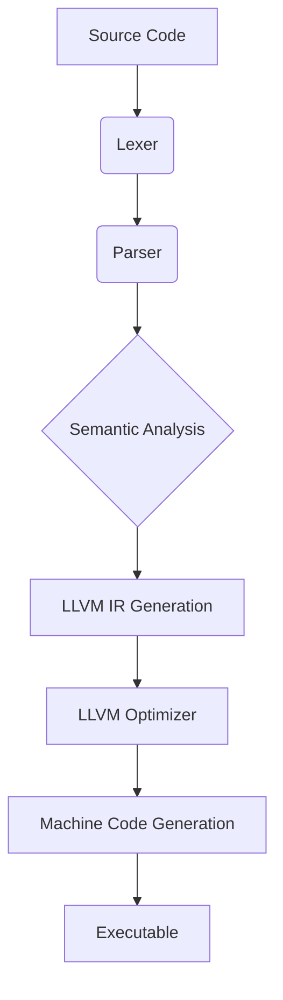

# PyCC Compiler Architecture Summary

## Overview
PyCC is a Python interpreter and compiler that generates LLVM IR for high-performance execution. This document provides a high-level overview of the compiler architecture and key components.

## System Architecture



## Compiler Phases

### 1. Lexical Analysis
- **Component**: Lexer
- **Input**: Source code text
- **Output**: Token stream
- **Responsibilities**: 
  - Tokenizing source code
  - Handling whitespace and comments
  - Error reporting for invalid characters

### 2. Syntax Analysis
- **Component**: Parser
- **Input**: Token stream
- **Output**: Abstract Syntax Tree (AST)
- **Responsibilities**:
  - Building syntactic representation of program
  - Error reporting for syntax violations
  - Expression parsing with proper precedence

### 3. Semantic Analysis
- **Component**: Semantic Analyzer
- **Input**: AST
- **Output**: Annotated AST with symbol information
- **Responsibilities**:
  - Variable resolution and scope management
  - Type checking and consistency verification
  - Function signature validation

### 4. LLVM IR Generation
- **Component**: Code Generator
- **Input**: Annotated AST
- **Output**: LLVM IR module
- **Responsibilities**:
  - Translating AST to LLVM IR
  - Managing LLVM context and module
  - Generating efficient LLVM instructions

### 5. Optimization and Code Generation
- **Component**: LLVM Backend
- **Input**: LLVM IR
- **Output**: Executable or object code
- **Responsibilities**:
  - Applying LLVM optimization passes
  - Generating target-specific machine code
  - Linking with runtime libraries

## Key Design Decisions

### Dynamic Typing with Optimizations
PyCC maintains Python's dynamic typing while implementing compile-time optimizations:
- Runtime type information for flexibility
- Type inference for performance improvements
- Specialization for frequently used type combinations

### LLVM Integration
- Direct LLVM API usage for code generation
- Leveraging LLVM's optimization passes
- Cross-platform code generation support

### Error Handling
- Comprehensive error reporting with source locations
- Multiple error collection for better developer experience
- Graceful degradation when optimizations fail

## Current Implementation Status

### Core Components
- [x] Lexer for tokenizing source code
- [x] Parser for building AST
- [x] Interpreter for direct execution
- [x] LLVM IR Code Generator
- [x] Command-line interface with run/compile modes

### Language Features
- [x] Variable assignments
- [x] Basic data types (integers, floats, strings, booleans, None)
- [x] Arithmetic expressions with operator precedence
- [x] Function definitions and calls
- [x] Print statements
- [ ] Control structures (if/else, while loops)
- [ ] Complex data structures (lists, dictionaries)
- [ ] Module system

### Execution Modes
- [x] Interpretation mode (`pycc run`)
- [x] Compilation mode (`pycc compile`)
- [x] LLVM IR generation (`pycc compile --emit-llvm`)
- [x] Executable generation
- [x] Optimization levels (0-3)

## Directory Structure
```
pycc/
├── src/          # Compiler source code
├── docs/         # Documentation
├── tests/        # Test suite
├── examples/     # Example programs
├── README.md     # Project overview
└── requirements.md # Project requirements
```

## Dependencies
- LLVM for code generation and optimization
- Rust (recommended) for compiler implementation
- Testing framework for validation

## Future Enhancements
- Advanced optimization techniques
- Debugging support
- Profiling integration
- Language server protocol implementation