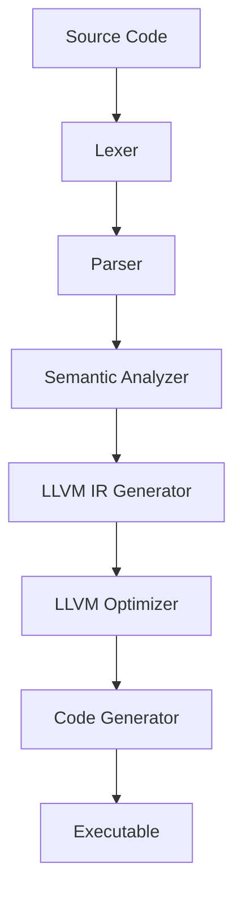

# PyCC Compiler - Current Architecture Status

## Project Overview
PyCC is a Python interpreter and compiler that combines the ease of use and expressiveness of Python with the performance benefits of compilation through LLVM. This document summarizes the current architecture implementation status for the PyCC compiler.

## Current Architecture Implementation

### 1. Language Design
We've implemented a language with Python syntax for:
- Familiar syntax for variables, functions, and expressions
- Dynamic typing system with runtime flexibility
- Support for core data types (integers, floats, strings, booleans, none)
- Function definitions and calls
- Control structures (if/else, while loops) - *planned*

### 2. Compiler Architecture
The compiler follows a traditional multi-phase architecture:

### 3. Implementation Components

#### Lexer
- [x] Tokenizes source code into meaningful units
- [x] Handles literals, identifiers, keywords, operators, and delimiters
- [x] Provides error reporting for lexical issues

#### Parser
- [x] Converts token stream into Abstract Syntax Tree (AST)
- [x] Implements grammar for expressions, statements, and functions
- [x] Handles operator precedence correctly

#### Interpreter
- [x] Direct execution of AST nodes
- [x] Variable management and function calls
- [x] Basic expression evaluation

#### LLVM IR Generator
- [x] Translates AST into LLVM Intermediate Representation
- [x] Manages LLVM context, modules, and IRBuilder
- [x] Implements dynamic typing through runtime structures

#### Compilation Pipeline
- [x] Orchestrates the complete compilation process
- [x] Integrates with LLVM for optimization and code generation
- [x] Manages output formats (executables, object files, LLVM IR)

### 4. Type System
- [x] Dynamic typing similar to Python for flexibility
- [x] Runtime type information for operations
- [ ] Compile-time optimizations through type inference
- [ ] Support for type specialization

### 5. Testing Strategy
- [x] Comprehensive unit testing for each component
- [x] Integration tests for language features
- [ ] Performance benchmarks for optimization validation
- [x] Regression tests for bug prevention

### 6. Documentation
- [x] Complete language reference
- [x] User guide with examples
- [x] Implementation documentation for each component
- [x] Roadmap for future development

## Current Implementation Status

We've completed Phase 1 (Foundation) and partially completed Phase 2 (Language Expansion):
1. [x] Foundation - Minimal Viable Compiler (COMPLETED)
2. [~] Language Expansion (PARTIALLY COMPLETED)
3. [~] Type System and Runtime (PARTIALLY COMPLETED)
4. [ ] Optimization and Performance
5. [ ] Advanced Language Features
6. [ ] Production Readiness

## Key Design Decisions

### Language Choice
- Implementation in Rust for performance and safety
- LLVM for code generation and optimization
- Dynamic typing with compile-time optimizations

### Performance Strategy
- Type inference for optimization opportunities
- LLVM's mature optimization passes
- Runtime specialization for frequently used types

### Error Handling
- Comprehensive error reporting with source locations
- Multiple error collection for better developer experience
- Graceful degradation when optimizations fail

## Next Steps

The implementation is progressing well. The recommended next steps are:

1. Complete Phase 2: Language Expansion
   - Implement control flow structures (if/else, while loops)
   - Improve variable scoping rules
   - Enhance error reporting with source locations
2. Begin Phase 3: Type System and Runtime
   - Implement runtime type checking
   - Add type conversion functions
   - Implement memory management

## Risk Mitigation

We've identified and planned for key risks:
- LLVM integration complexity through incremental implementation
- Dynamic typing performance through runtime optimizations
- Schedule management through phased approach with regular assessments

## Conclusion

The PyCC compiler has made significant progress with a working foundation. The modular design allows for incremental implementation while maintaining a clear path to a fully-featured compiler. The use of LLVM ensures high-quality code generation and cross-platform support, while the dynamic type system maintains the expressiveness that makes Python popular.